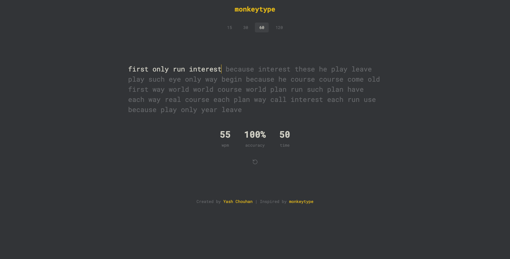

# Typing Speed Test Application

A modern, minimalist typing test application built with Spring MVC and vanilla JavaScript. Test and improve your typing speed with real-time WPM (Words Per Minute) and accuracy tracking.



## Features

- 🕒 Multiple test durations (15s, 30s, 60s, 120s)
- 📊 Real-time WPM and accuracy calculation
- 🎯 Live character tracking with visual feedback
- 🔄 Instant test restart capability
- 💾 Test results storage with H2 database
- 🎨 Clean, modern UI inspired by monkeytype

## Technologies Used

### Backend
- Java 17
- Spring MVC 6.1.2
- Spring Data JPA
- Hibernate 6.4.1
- H2 Database
- Jakarta EE 10
- Apache Tomcat 10.1.34

### Frontend
- HTML5
- CSS3 (Custom properties, Flexbox)
- Vanilla JavaScript
- Google Fonts (Roboto Mono)

### Build Tools
- Maven
- WAR packaging

## Getting Started

### Prerequisites
- Java JDK 17 or higher
- Apache Maven
- Apache Tomcat 10.1.x

### Installation

1. Clone the repository
```bash
git clone https://github.com/iamyashchouhan/typing-test.git
